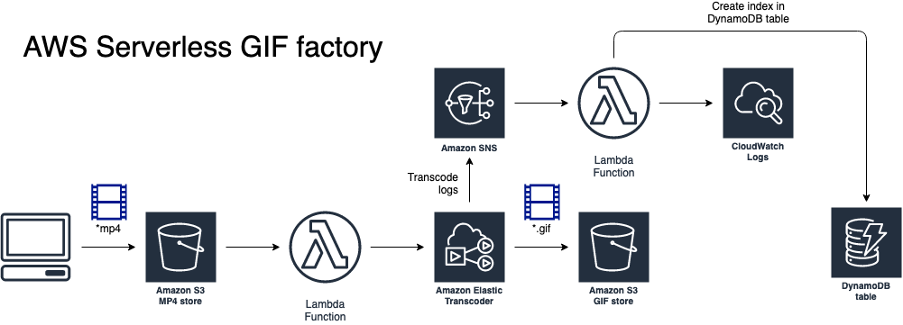

+++ 
title = "Workshop - AWS Serverless GIF factory" 
chapter = true 
weight = 1 
+++

## 
AWS Partner: AWS Serverless GIF factory

*About the Labs*

In this workshop you will create a *Serverless* GIF factory application on AWS. You will work with the following AWS services:

* S3
* IAM
* DynamoDB
* SNS
* CloudWatch Logs
* Elastic Transcoder
* Lambda

This will be the final architecture:

Learn more: <a href="https://aws.amazon.com/serverless/" target="_blank">Serverless on AWS</a>



AWS re:Invent 2020: Getting started building your first serverless web application

## 
Upcoming Training for Partners

**Training calendar for Partners** <a href="https://aws.amazon.com/partners/training/partner-course-schedule/?partner-training-cert-cards.sort-by=item.additionalFields.startDateSort&partner-training-cert-cards.sort-order=asc&awsf.location=location%23namer" target="_blank">[North America]</a> <a href="https://aws.amazon.com/es/partners/training/latam/" target="_blank">[Latin America]</a> <a href="https://aws.amazon.com/pt/partners/training/latam-br/" target="_blank">[Brasil]</a>

**Partnercast Calendar** <a href="https://aws.amazon.com/partners/training/partnercast/?partnercast-training-webinar-cards.sort-by=item.additionalFields.sortText&partnercast-training-webinar-cards.sort-order=asc&awsf.partnercast-training-webinar-filter-content-type=*all&awsf.partnercast-training-webinar-filter-language=language%23english&awsm.page-partnercast-training-webinar-cards=1&awsf.partnercast-training-webinar-filter-audience=*all&awsf.partnercast-training-webinar-filter-series=*all&awsf.partnercast-training-webinar-filter-location=*all&awsf.partnercast-training-webinar-filter-technology-category=*all" target="_blank">[English]</a> <a href="https://aws.amazon.com/partners/training/partnercast/?partnercast-training-webinar-cards.sort-by=item.additionalFields.sortText&partnercast-training-webinar-cards.sort-order=asc&awsf.partnercast-training-webinar-filter-content-type=*all&awsf.partnercast-training-webinar-filter-language=language%23spanish&awsm.page-partnercast-training-webinar-cards=1&awsf.partnercast-training-webinar-filter-audience=*all&awsf.partnercast-training-webinar-filter-series=*all&awsf.partnercast-training-webinar-filter-location=*all&awsf.partnercast-training-webinar-filter-technology-category=*all" target="_blank">[Español]</a> <a href="https://aws.amazon.com/partners/training/partnercast/?partnercast-training-webinar-cards.sort-by=item.additionalFields.sortText&partnercast-training-webinar-cards.sort-order=asc&awsf.partnercast-training-webinar-filter-content-type=*all&awsf.partnercast-training-webinar-filter-language=language%23portuguese&awsm.page-partnercast-training-webinar-cards=1&awsf.partnercast-training-webinar-filter-audience=*all&awsf.partnercast-training-webinar-filter-series=*all&awsf.partnercast-training-webinar-filter-location=*all&awsf.partnercast-training-webinar-filter-technology-category=*all" target="_blank">[Português]</a>